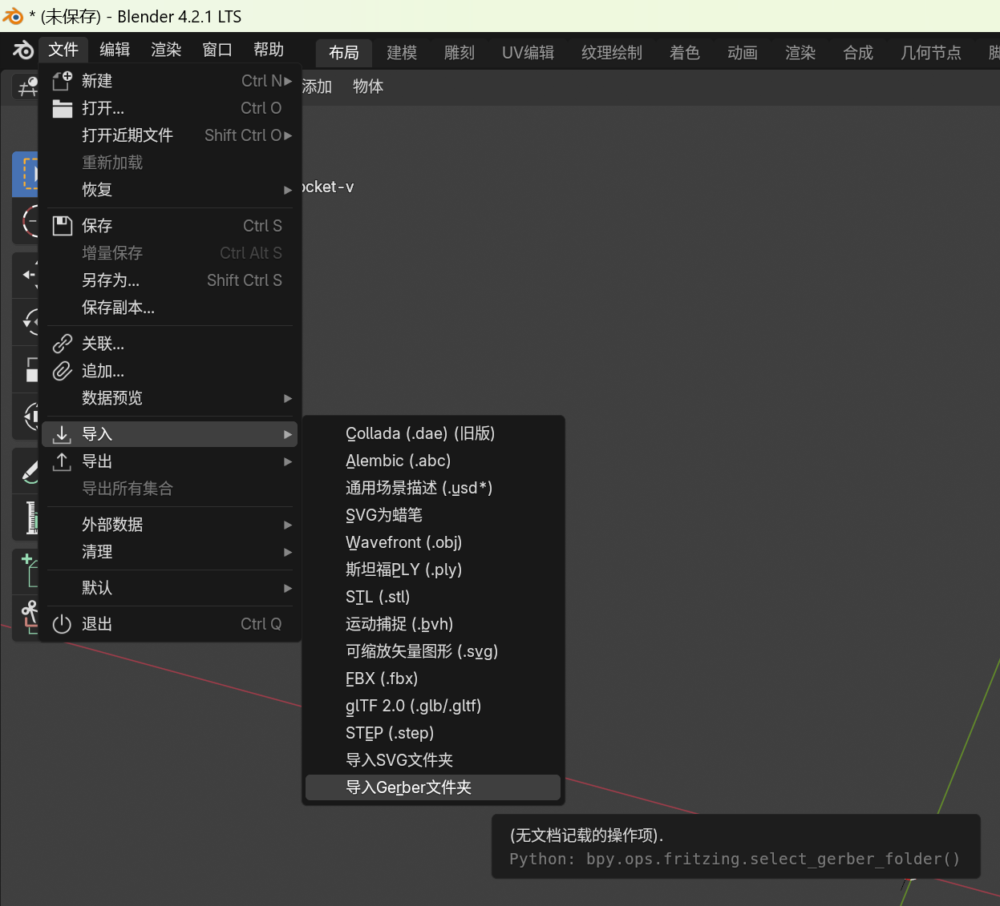
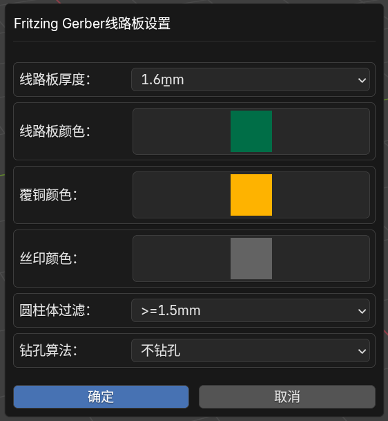
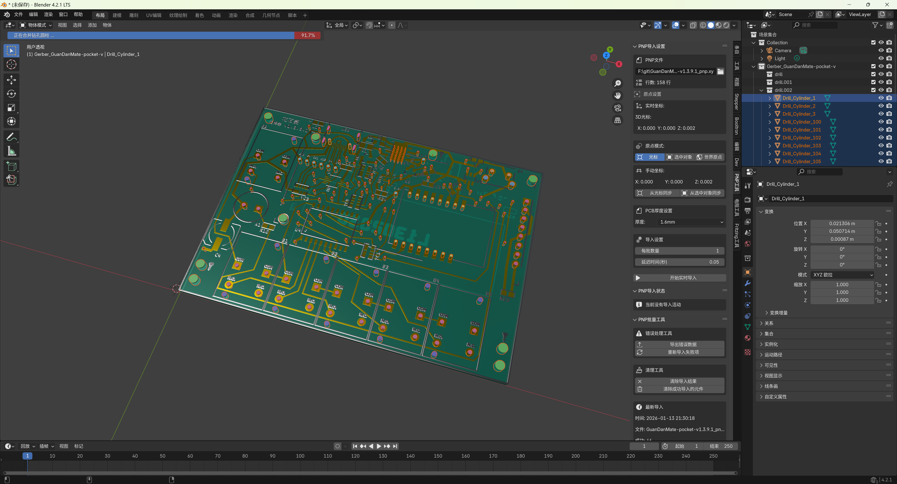
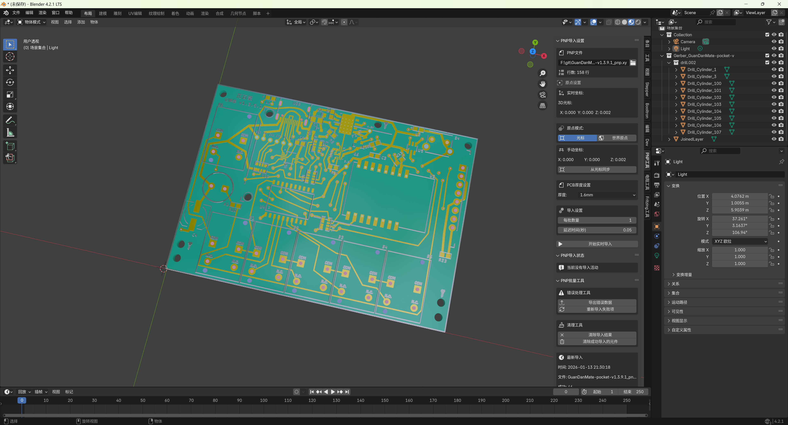
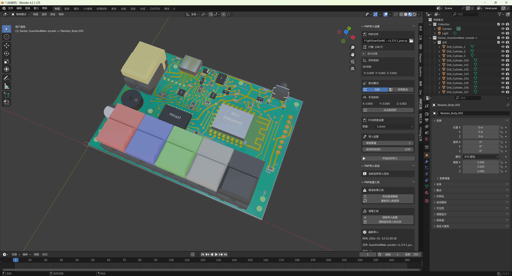
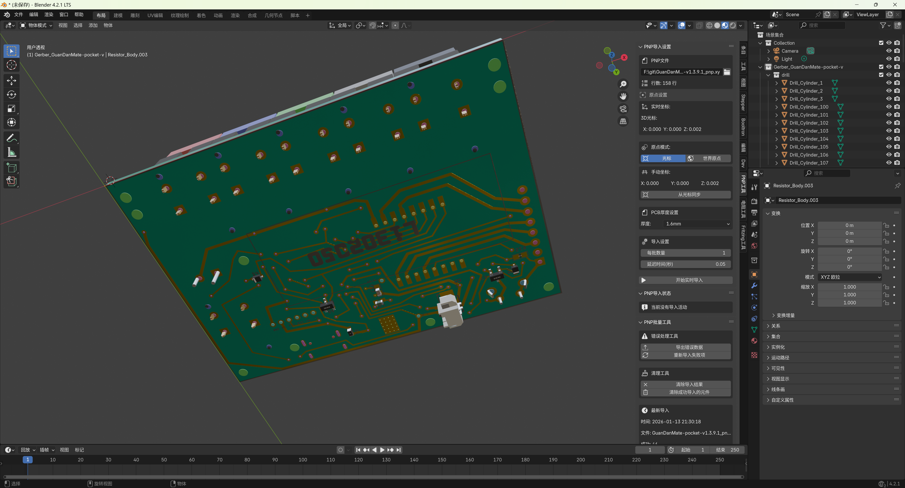

# FritzingToBlender
这是一个Blender插件，修改自[GerberToBlender](https://github.com/francis-chris5/GerberToBlender)。本项目目的是把Fritzing导出的Gerber目录，转成3D PCB板模型，以便精确设计安装螺孔位置和外壳等。

## 适用
Blender 4.2.1 + Bool Tool 1.1.2插件

## 功能
1. 导入Gerber文件
2. 导入PNP文件
3. 导入钻孔文件
4. 导入SVG文件
5. 生成电阻等3D模型

## 为Blender安装python模块

1. 在Windows中，以系统管理员身份打开终端，进入Blender自己的python目录，比如：cd '..\..\Program Files\Blender Foundation\Blender 4.2\4.2\python\bin\'

2. 安装所需python包：
```
.\python.exe -m pip install -r requirements.txt
```

## 使用

### 导入Gerber文件

#### Fritzing

1. 在Fritzing中，选择【PCB】界面，选择【导出为PCB】->【Extended Gerber(RS-274X)...】，导出

### Blender

1. 把本项目下载为一个zip文件，在Blender中，选择菜单【编辑】->【偏好设置】->【获取扩展】->从右上角的下拉菜单栏选择【从磁盘安装】->选择之前下载的zip文件进行安装

2. 安装本模块后，在Blender中，选择菜单【文件】->【导入】->【导入Gerber文件夹】，即可导入在Fritzing中导出的Gerber文件，导入过程如下图所示：









[br][br]

### 导入PNP文件

1. 在Blenderd的3D视图中，选择右侧菜单->【PNP工具】，即可导入在Fritzing导出的Gerber文件中的_pnp.xy文件，如下图所示：







[br][br]

2. 导入PNP时，3D模型是通过Python脚本生成的。本项目中的3D模型脚本，均是在DeepSeek AI的帮助下编写的，每个模型的脚本的开发时间，平均在2天左右。


## 开发调试

1. 下载和安装VS Code
2. 在VS Code中，搜索并安装Blender Development插件
3. 在VS Code中，下载本项目源码
4. 在VS Code中，在"Command Pallete"中，运行"Blender: Build and Start"，下一步选择安装好的blender.exe，会启动这个Blender
5. 在VS Code中修改本项目源码，在Blender中查看修改后的执行结果
6. Gerber解析基于pcb_tools，只有一处windows下读文件权限问题的修改，将rU改为r。

## 后续开发计划

1. 完善PNP中用的元器件模型，欢迎提issue，丰富模型数量。

2. 完善基于布尔运算的钻孔算法，提升质量和运算速度。


## 参考资料
1. [How to add a progress indicator to the Info header in Blender](https://blog.michelanders.nl/2017/04/how-to-add-progress-indicator-to-the-info-header-in-blender.html)

